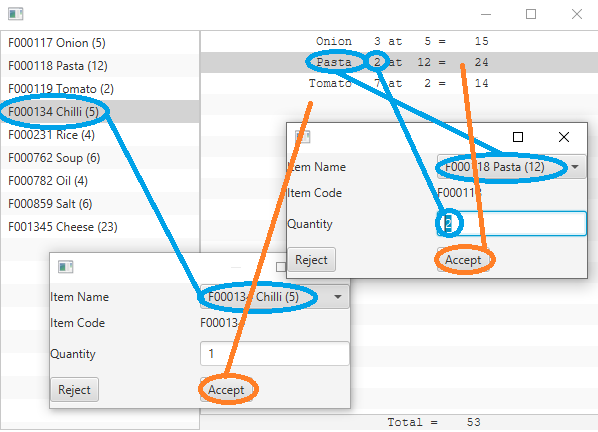
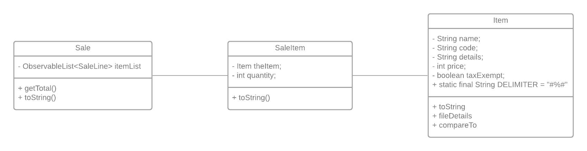

# Inter Window Communication

The window above shows a small JavaFX application that has a list of items on the left and sales on the right. When either item is clicked then dialog box is opened. Data on the dialog box comes from the main window and then when the dialog is accepted the data is sent back to the main window.

The flow of communication is shown by the coloured arrows. Blue from the main window to the dialog box and red from the dialog box bac to the main window.

Understanding the application requires first a brief overview of how a GUI is developed in JavaFX .

A JavaFX application will have a number of different types of files these fall into the following categories.

## Main Application

Classes that manage the data

Controller that manages the interaction between the data and the GUI

FXML files that describe the GUI elements

The Application
The main application is a simple boilerplate file that starts the application and needs to know the name of the FXML file that will be used to generate the main window. When the window is set up it is placed in a Stage object this Stage object will be used later to also hold the dialog boxes so it is stored as a property of this class.

public class StockManagement extends Application {

    public static Stage primaryStage;

    @Override

    public void start(Stage stage) throws Exception {

        primaryStage = stage;        

        

        Parent root = FXMLLoader.load(getClass().getResource("FXMLMainWindow.fxml"));

        Scene scene = new Scene(root);

        primaryStage.setScene(scene);

        primaryStage.show();

    }

    public static void main(String[] args) {

        launch(args);

    }

    

} // end of class StockManagement

## The Data
The data consists of three classes, as shown in the diagram below:

The Sale object has a list of SaleItems and each SaleItem has a reference to an Item object. The main window will display a list of all items in the left side of the window and then it will display all the SaleItems (which are held in the Sale object) in the right side of the screen.

## Communicating with the dialog box
The main logic for inter window communication lies within the controllers of each window. When an item in the list is clicked then a method will be called that will create the window and display it. The method that is used to create a new saleItem is shown below:

    @FXML private void addItemDialog() {

        // Code that will display the dialog

        selectedItem = items.getSelectionModel().getSelectedItem();

        

        FXMLLoader loader = new FXMLLoader(getClass().getResource("ItemSale.fxml"));

        Stage stage = getStage(loader);

        // Get the dialog controller so that a public method can be run to send date to the dialog

        SellItemController sic = loader.<SellItemController>getController();

        sic.setItemNames(allItems, selectedItem, this);

        sic.setItemCode(selectedItem.getCode());

        

        // Show the dialog (and wait for the user to close it)

        stage.showAndWait();

        // use the dialog controller to call a public method to get data from it

        if (!sic.getQuantity().equals("")){

            selectedItem = sic.getItem();

            int quantity = Integer.parseInt(sic.getQuantity());

            SaleLine sl = new SaleLine(selectedItem, quantity);

            allSaleLines.add(sl);

            lblTotal.setText(sale.getTotal());

        }

    } // end of method addItemDialog

The @FXML macro allows the method to be linked to the ListView in the FXML file in such a way that when an item is clicked by the user then this code will run. The first line gets the item object that was selected by the user. The next lines are standard code that is used to create the dialog box. Essentially they get the loader, the stage and then the controller. The controller object for the dialog box is then used call methods from this class to populate the controls in the dialog box with the data that should be shown, for this the Item List, the selected Item and the code of the selected Item. Next the stage object is used to show the dialog box and in this case it will wait until the dialog box has been closed, only then will the rest of the code in this method be executed.

After the user closes the dialog box then the rest of the code is executed. In this case it uses the controller object to look at the data and then if appropriate create a new SaleLine object and add that to the mainWindow display and update the sale total in the foot of the main window.

## Communicating with the main window when the dialog box is still open
The same technique can be used to communicate with the main window when the dialog box is still open. So if the user changes the item within the dialog box this can be reflected in the MainWindow by showing the change in the selectedItem.  The mainWindow controller has the following code, which sets and shows the selected Item and this will be used by the dialog box.

    public void updateItemSelection(Item newItem){

        items.getSelectionModel().select(newItem);

        selectedItem = newItem;

    }

Now in the controller for the dialog box the initialisation method is as follows:

    @Override

    public void initialize(URL url, ResourceBundle rb) {

        txtItemAmount.setText("1");

        cbItemNames.getSelectionModel().selectedItemProperty().addListener(new ChangeListener<Item>(){

            public void changed(ObservableValue ov, Item value, Item newValue){

                item = newValue;

                setItemCode(item.getCode());

                if (parentController != null){

                    parentController.updateItemSelection(newValue);

                }

            }

        });

    } // end of initialize()

The ChoiceBox in the dialog box is called cbItemNames and a listener is set up for whenever the value is changed. The both the old and new values are passed into this listener, and as well as setting up some variables within this controller it will call the updateItemSelection() method so that the changes are also reflected on the mainWindow.
